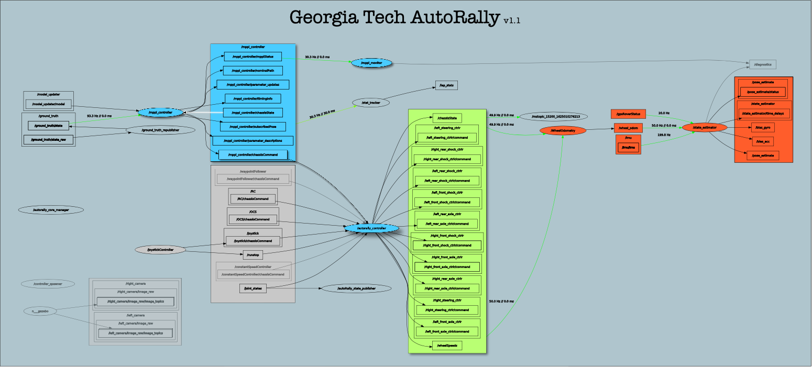

# _/// SNOW-AutoRally /////////////////////////////////////////_
A NorLab project based on a fork of the [Georgia Tech AutoRally](https://github.com/AutoRally/autorally) repository 

  

Project link: 
- [Youtrack](https://redleader.myjetbrains.com/youtrack/dashboard?id=bce3112d-bda1-425c-8628-802a047be4d3) dashboard
- [Dockerized SNOW](https://github.com/RedLeader962/SNOW_AutoRally)

 

( <a href="https://app.diagrams.net/?mode=github#HRedLeader962%2Fautorally%2FSNOW-melodic-devel%2Fdrawio%2FGeorgia_Tech_AutoRally_v1.drawio" target="_blank" rel="noopener noreferrer">Edit
</a>
diagram)

 

Georgia Tech AUtoRally links:
- [Original readme (modified)](README.md) 
- [AutoRally/autorally: Software for the AutoRally platform](https://github.com/AutoRally/autorally)
- [Home · AutoRally/autorally Wiki](https://github.com/AutoRally/autorally/wiki)